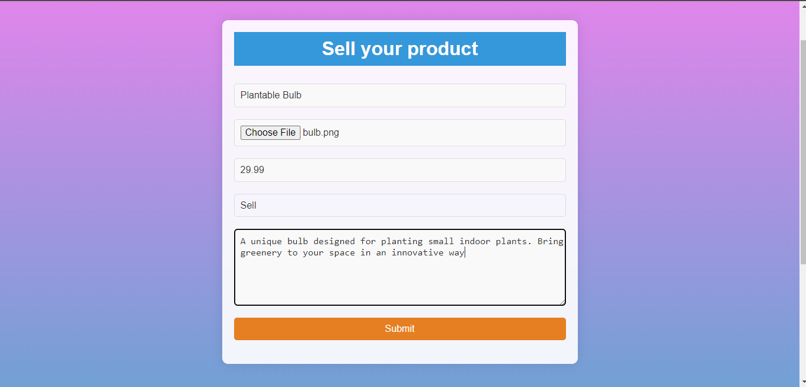
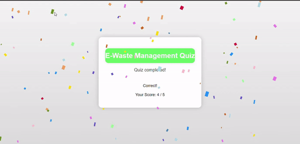
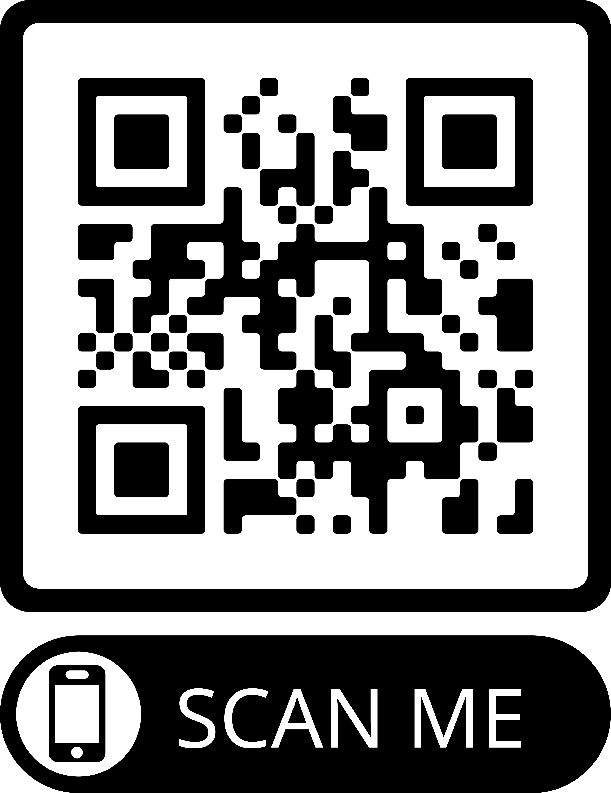

# 🌱 Welcome to E-WasteCare 🌍

E-WasteCare is your **eco-friendly haven** for responsible electronic waste management. Our platform offers a diverse range of services and resources to promote sustainable e-waste practices and raise awareness about the importance of proper disposal. ♻️

## 🛠️ Our Services

### 1. Product Recycling ♻️
Dispose of your old electronic devices responsibly through our efficient recycling process. We ensure that valuable materials are recovered and harmful elements are handled safely.

  
*🚀 Witness your old gadgets transform into something new!*

### 2. Sell E-Waste Products 💰
Have electronic items you no longer need? Sell them through E-WasteCare's marketplace and contribute to reducing electronic waste.

*💸 Turn your e-waste into extra cash while helping the planet!*

### 3. Organize Events 🎉
We host electrifying events and engaging workshops to empower communities with insights into the impact of e-waste on the environment and effective management strategies.

 
*🌟 Join us for interactive sessions that light up the path to sustainable living!*

### 4. Interactive Quiz 🧠
Challenge your knowledge about e-waste and recycling with our captivating quizzes. Learn and have fun while making a difference!

 
*🧐 Test your eco-savviness and unlock the secrets of responsible e-waste handling!*

### 5. Blogs on E-Waste 📚
Stay informed with our treasure trove of regularly updated blogs, featuring pearls of wisdom from experts in the field of e-waste management and sustainable living.

 
*📖 Explore informative articles that guide you toward a greener lifestyle!*

### 6. Innovative Ideas Submission 💡
Unleash your creativity! Share your ingenious ideas for e-waste management and earn a chance to showcase your brilliance on our platform.

 
*🌈 Your innovative ideas could be the spark that revolutionizes e-waste management!*

## 🚀 Get Involved

Join us in our mission to make a **positive impact** on the environment. Blast off to our [website](https://e-wastecare.onrender.com/) and dive into the diverse services and resources we offer.

🌐 **Connect with us:**
- Facebook: [E-WasteCare](https://www.facebook.com/e-wastecare)
- Twitter: [@E_WasteCare](https://www.twitter.com/e_wastecare)
- Instagram: [@e.wastecare](https://www.instagram.com/e.wastecare)

Together, let's illuminate the path toward a cleaner and more sustainable future for generations to come. 🌈

## 📲 Scan the QR Code

Scan the QR code below or visit the link to access our website:

https://e-wastecare.onrender.com/
